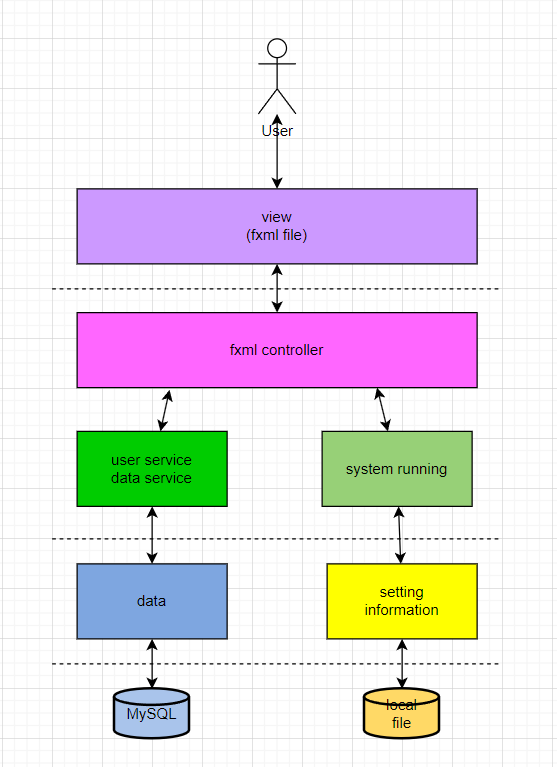

# 一、引言

## 1. 编写目的

本文档为将需求落地，提供系统大概设计方向

## 2. 参考资料

[用户需求说明书](*)

[产品需求规格说明书](软件规格需求说明书.md)

# 二、系统总体设计

## 1. 整体架构

本系统采用JavaEE三层架构，分为六个模块`base`、`dao`、`service`、`controller`、`fxml`、`util`

## 2. 整体功能架构

### (1). 用户界面

从登录界面跳到对应的用户界面

#### &nbsp;&nbsp;&nbsp;&nbsp;a. 学生端

#### &nbsp;&nbsp;&nbsp;&nbsp;b. 教师端

#### &nbsp;&nbsp;&nbsp;&nbsp;c. 管理总端

### (2). 登录界面

### (3). 注册界面

### (4). 忘记密码界面

### 密码找回页

## 3. 整体技术架构

使用JavaEE三层架构，使用JavaFX框架，系统使用logback记录日志，使用json作为系统的额外语言包，使用fastjson2对json文件进行解析

## 4. 运行环境设计

不设计

## 5. 设计目标

实现一个完善的学生成绩管理系统

# 三、系统功能模块设计

## 1. `base`模块:

提供一些基础类和一些基础的接口让其他模块实现

## 2. `dao`层

提供数据库链接以及数据库连接后的数据操作，分为用户操作、课程操作和联系操作  
所有数据库的数据操作都包含增删改查

### `MySQL.dao`模块: 

提供数据库链接时使用MySQL数据库

### `Sqlite.dao`模块: 

提供数据库链接时使用Sqlite数据库

## 3. `service`模块: 

提供封装好的操作让controller调用，换言之是在根据controller调用dao的方法

## 4. `view`模块: 

分为controller和fxml，fxml文件提供界面设计，controller负责监听用户操作并调用对应的service方法

# 四、性能设计

仅设计一个线程，不设计多线程操作

## 1. 响应时间

## 2. 并发用户数

窗口应用仅限一个用户操作

# 五、接口设计

## 1. 接口设计原则

抽象但明确，每个接口都要有实际意义

## 2. 接口实现方式

通过对应实现类

# 六、运行设计

## 1. 运行模块的组合

用户启动view模块中的App类，App类中加载Login.fxml文件，通过fxml绑定的controller类进行后续操作

## 2. 运行控制

## 3. 运行时间

# 七、系统出错处理设计

## 1. 出错信息

## 2. 补救措施

## 3. 系统维护设计

实在不行就重构